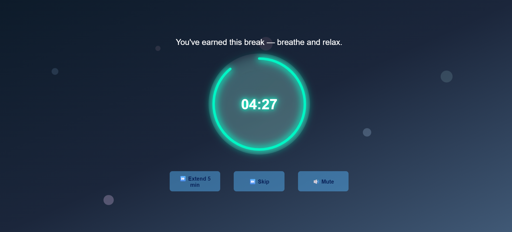
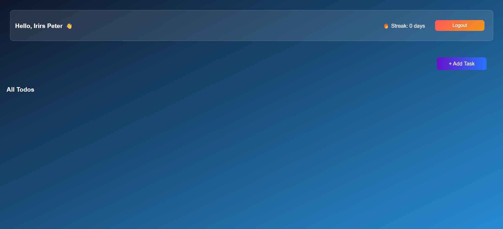
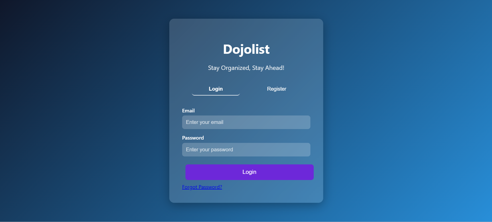
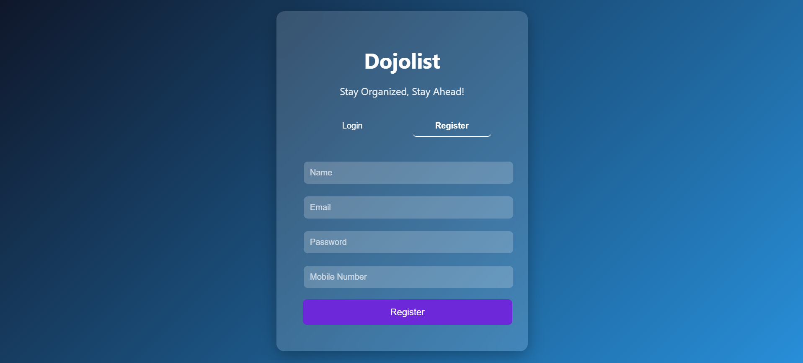
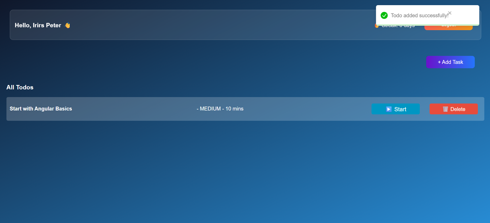
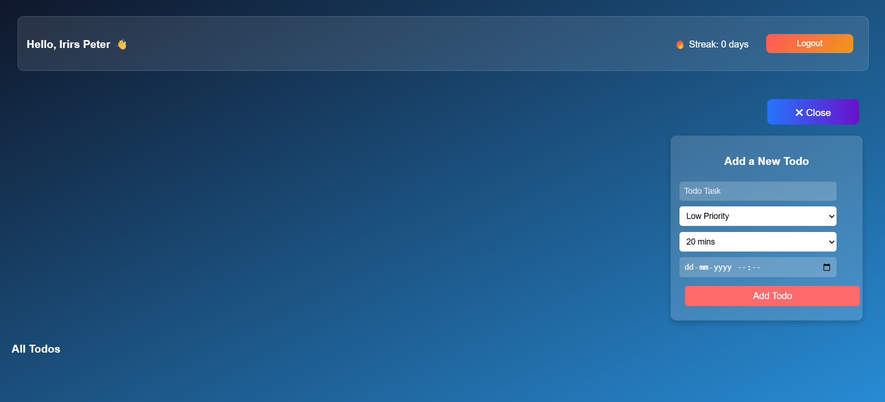
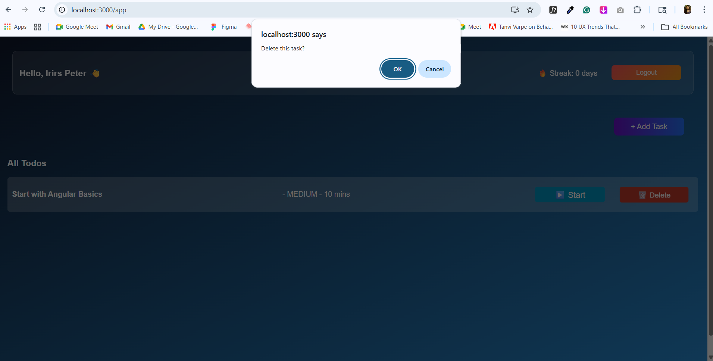
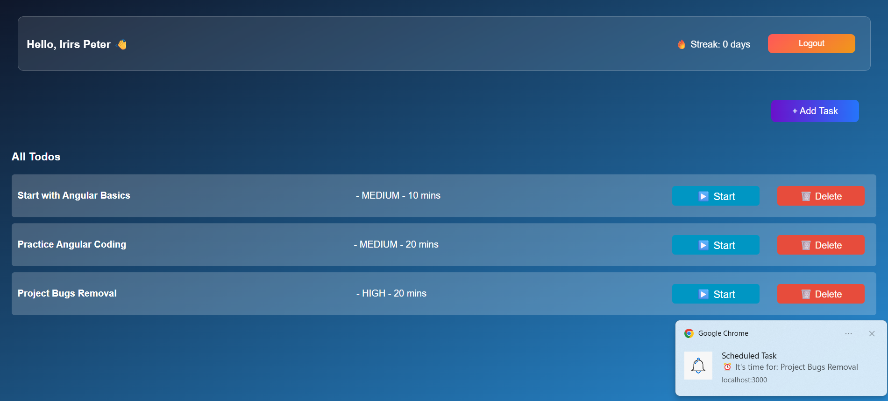
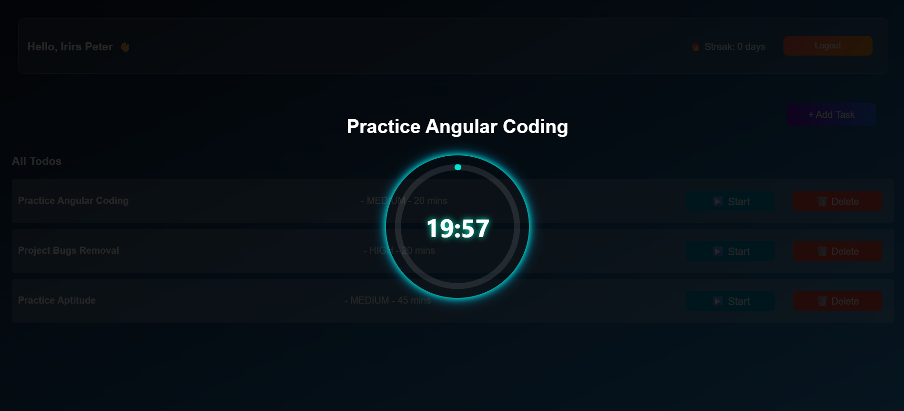
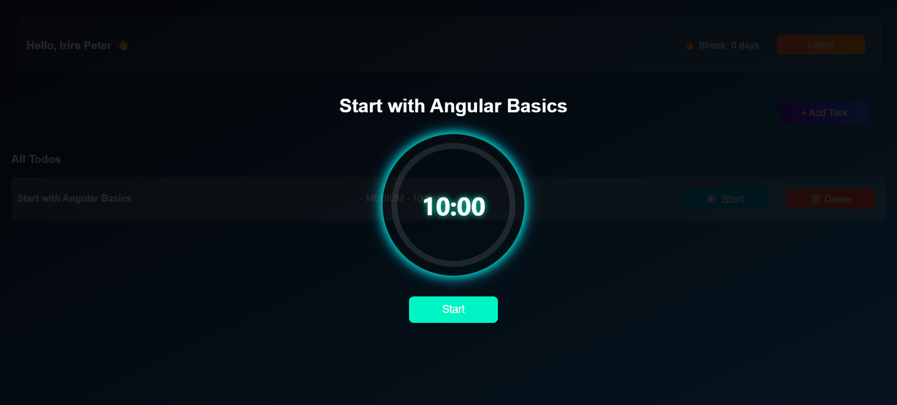

# 📝 DojoList - Smart Productivity App

DojoList is a full-stack productivity application designed to help users manage tasks efficiently with focus sessions and break timers.

---

## 🚀 Features

- ✅ Add, delete, and manage tasks
- ⏱️ Task timer with focus mode
- 🎯 Daily goal tracking
- 🔥 Streak system
- 🔔 Notifications for scheduled tasks
- 🌿 Break timer (Zen mode)

---

## 🛠️ Tech Stack

**Frontend:**
- React.js
- CSS (Custom UI)

**Backend:**
- Spring Boot
- REST APIs

**Database:**
- MySQL

---

## 📸 Screenshots













---

## ⚙️ Setup Instructions

### Backend
```bash
cd backend
mvn spring-boot:run
```

### Frontend
```bash
cd frontend
npm install
npm start
```

---

## 💡 Future Improvements

- Dark/Light theme toggle
- Mobile responsiveness
- User authentication improvements

---

## 👩‍💻 Author

Your Name